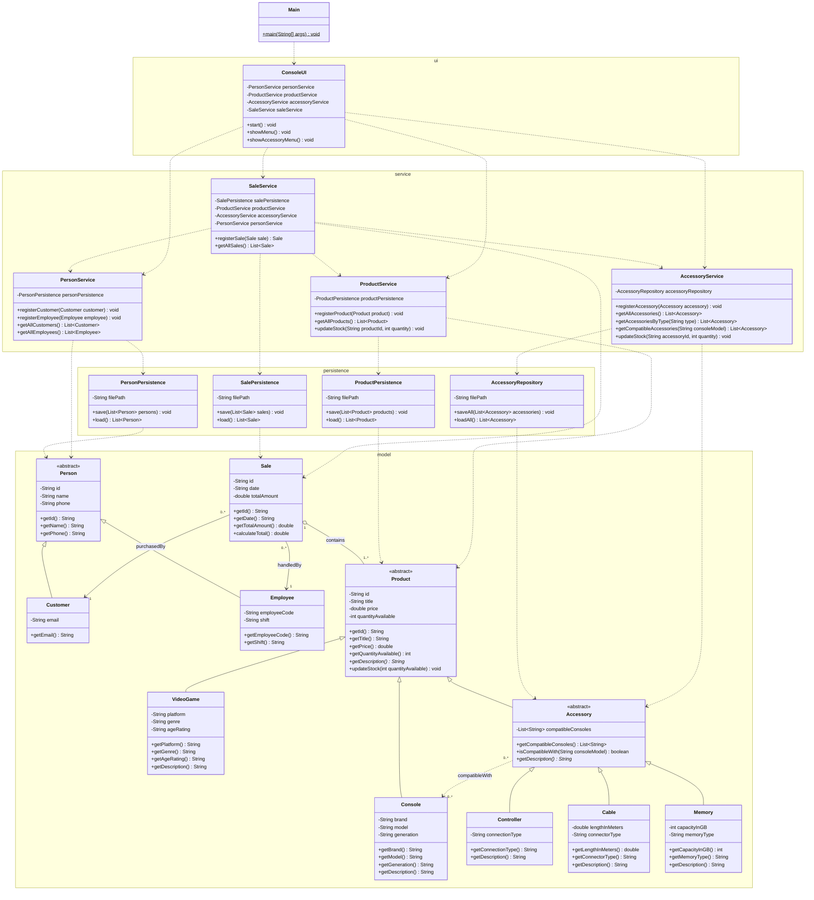

```mermaid
classDiagram
direction TB
	namespace model {
        class Person {
	        -String id
	        -String name
	        -String phone
	        +getId() String
	        +getName() String
	        +getPhone() String
        }

        class Customer {
	        -String email
	        +getEmail() String
        }

        class Employee {
	        -String employeeCode
	        -String shift
	        +getEmployeeCode() String
	        +getShift() String
        }

        class Product {
	        -String id
	        -String title
	        -double price
	        -int quantityAvailable
	        +getId() String
	        +getTitle() String
	        +getPrice() double
	        +getQuantityAvailable() int
	        +getDescription() String*
	        +updateStock(int quantityAvailable) void
        }

        class VideoGame {
	        -String platform
	        -String genre
	        -String ageRating
	        +getPlatform() String
	        +getGenre() String
	        +getAgeRating() String
	        +getDescription() String
        }

        class Console {
	        -String brand
	        -String model
	        -String generation
	        +getBrand() String
	        +getModel() String
	        +getGeneration() String
	        +getDescription() String
        }

        class Accessory {
	        -List~String~ compatibleConsoles
	        +getCompatibleConsoles() List~String~
	        +isCompatibleWith(String consoleModel) boolean
	        +getDescription() String*
        }

        class Controller {
	        -String connectionType
	        +getConnectionType() String
	        +getDescription() String
        }

        class Cable {
	        -double lengthInMeters
	        -String connectorType
	        +getLengthInMeters() double
	        +getConnectorType() String
	        +getDescription() String
        }

        class Memory {
	        -int capacityInGB
	        -String memoryType
	        +getCapacityInGB() int
	        +getMemoryType() String
	        +getDescription() String
        }

        class Sale {
	        -String id
	        -String date
	        -double totalAmount
	        +getId() String
	        +getDate() String
	        +getTotalAmount() double
	        +calculateTotal() double
        }
	}

	namespace persistence {
        class ProductPersistence {
	        -String filePath
	        +save(List~Product~ products) void
	        +load() List~Product~
        }

        class PersonPersistence {
	        -String filePath
	        +save(List~Person~ persons) void
	        +load() List~Person~
        }

        class SalePersistence {
	        -String filePath
	        +save(List~Sale~ sales) void
	        +load() List~Sale~
        }

        class AccessoryRepository {
	        -String filePath
	        +saveAll(List~Accessory~ accessories) void
	        +loadAll() List~Accessory~
        }
	}

	namespace service {
        class ProductService {
	        -ProductPersistence productPersistence
	        +registerProduct(Product product) void
	        +getAllProducts() List~Product~
	        +updateStock(String productId, int quantity) void
        }

        class PersonService {
	        -PersonPersistence personPersistence
	        +registerCustomer(Customer customer) void
	        +registerEmployee(Employee employee) void
	        +getAllCustomers() List~Customer~
	        +getAllEmployees() List~Employee~
        }

        class AccessoryService {
	        -AccessoryRepository accessoryRepository
	        +registerAccessory(Accessory accessory) void
	        +getAllAccessories() List~Accessory~
	        +getAccessoriesByType(String type) List~Accessory~
	        +getCompatibleAccessories(String consoleModel) List~Accessory~
	        +updateStock(String accessoryId, int quantity) void
        }

        class SaleService {
	        -SalePersistence salePersistence
	        -ProductService productService
	        -AccessoryService accessoryService
	        -PersonService personService
	        +registerSale(Sale sale) Sale
	        +getAllSales() List~Sale~
        }
	}

	namespace ui {
        class ConsoleUI {
	        -PersonService personService
	        -ProductService productService
	        -AccessoryService accessoryService
	        -SaleService saleService
	        +start() void
	        +showMenu() void
	        +showAccessoryMenu() void
        }
	}

    class Main {
	    +main(String[] args) void$
    }

	<<abstract>> Person
	<<abstract>> Product
	<<abstract>> Accessory

    Person <|-- Customer
    Person <|-- Employee
    Product <|-- VideoGame
    Product <|-- Console
    Product <|-- Accessory
    Accessory <|-- Controller
    Accessory <|-- Cable
    Accessory <|-- Memory

    Accessory "0..*" ..> "0..*" Console : compatibleWith
    Sale "0..*" --> "1" Customer : purchasedBy
    Sale "0..*" --> "1" Employee : handledBy
    Sale "1" o-- "1..*" Product : contains

    ProductPersistence ..> Product
    PersonPersistence ..> Person
    SalePersistence ..> Sale
    AccessoryRepository ..> Accessory

    PersonService ..> PersonPersistence
    ProductService ..> ProductPersistence
    AccessoryService ..> AccessoryRepository
    SaleService ..> SalePersistence
    SaleService ..> ProductService
    SaleService ..> AccessoryService
    SaleService ..> PersonService

    ProductService ..> Product
    PersonService ..> Person
    AccessoryService ..> Accessory
    SaleService ..> Sale

    ConsoleUI ..> PersonService
    ConsoleUI ..> ProductService
    ConsoleUI ..> AccessoryService
    ConsoleUI ..> SaleService
    Main ..> ConsoleUI
```
