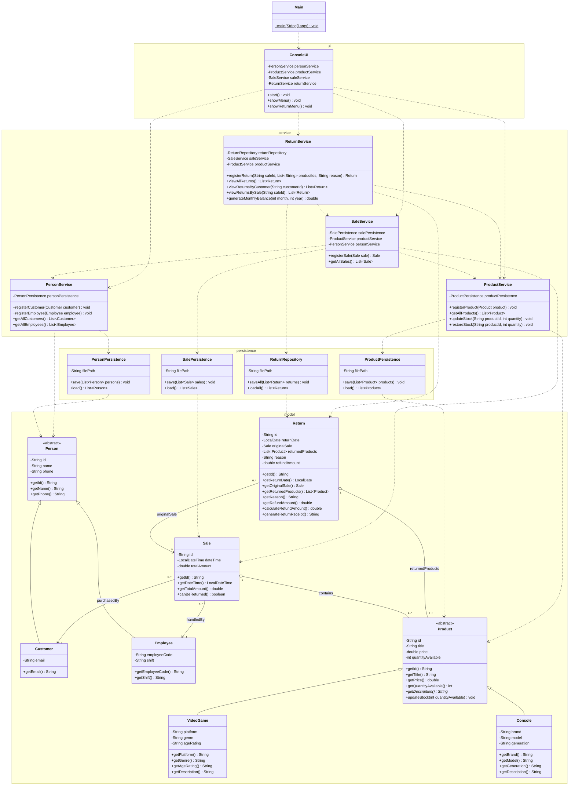

```mermaid
classDiagram
direction TB
	namespace model {
        class Person {
	        -String id
	        -String name
	        -String phone
	        +getId() String
	        +getName() String
	        +getPhone() String
        }

        class Customer {
	        -String email
	        +getEmail() String
        }

        class Employee {
	        -String employeeCode
	        -String shift
	        +getEmployeeCode() String
	        +getShift() String
        }

        class Product {
	        -String id
	        -String title
	        -double price
	        -int quantityAvailable
	        +getId() String
	        +getTitle() String
	        +getPrice() double
	        +getQuantityAvailable() int
	        +getDescription() String*
	        +updateStock(int quantityAvailable) void
        }

        class VideoGame {
	        -String platform
	        -String genre
	        -String ageRating
	        +getPlatform() String
	        +getGenre() String
	        +getAgeRating() String
	        +getDescription() String
        }

        class Console {
	        -String brand
	        -String model
	        -String generation
	        +getBrand() String
	        +getModel() String
	        +getGeneration() String
	        +getDescription() String
        }

        class Sale {
	        -String id
	        -LocalDateTime dateTime
	        -double totalAmount
	        +getId() String
	        +getDateTime() LocalDateTime
	        +getTotalAmount() double
	        +canBeReturned() boolean
        }

        class Return {
	        -String id
	        -LocalDate returnDate
	        -Sale originalSale
	        -List~Product~ returnedProducts
	        -String reason
	        -double refundAmount
	        +getId() String
	        +getReturnDate() LocalDate
	        +getOriginalSale() Sale
	        +getReturnedProducts() List~Product~
	        +getReason() String
	        +getRefundAmount() double
	        +calculateRefundAmount() double
	        +generateReturnReceipt() String
        }
	}

	namespace persistence {
        class ProductPersistence {
	        -String filePath
	        +save(List~Product~ products) void
	        +load() List~Product~
        }

        class PersonPersistence {
	        -String filePath
	        +save(List~Person~ persons) void
	        +load() List~Person~
        }

        class SalePersistence {
	        -String filePath
	        +save(List~Sale~ sales) void
	        +load() List~Sale~
        }

        class ReturnRepository {
	        -String filePath
	        +saveAll(List~Return~ returns) void
	        +loadAll() List~Return~
        }
	}

	namespace service {
        class ProductService {
	        -ProductPersistence productPersistence
	        +registerProduct(Product product) void
	        +getAllProducts() List~Product~
	        +updateStock(String productId, int quantity) void
	        +restoreStock(String productId, int quantity) void
        }

        class PersonService {
	        -PersonPersistence personPersistence
	        +registerCustomer(Customer customer) void
	        +registerEmployee(Employee employee) void
	        +getAllCustomers() List~Customer~
	        +getAllEmployees() List~Employee~
        }

        class SaleService {
	        -SalePersistence salePersistence
	        -ProductService productService
	        -PersonService personService
	        +registerSale(Sale sale) Sale
	        +getAllSales() List~Sale~
        }

        class ReturnService {
	        -ReturnRepository returnRepository
	        -SaleService saleService
	        -ProductService productService
	        +registerReturn(String saleId, List~String~ productIds, String reason) Return
	        +viewAllReturns() List~Return~
	        +viewReturnsByCustomer(String customerId) List~Return~
	        +viewReturnsBySale(String saleId) List~Return~
	        +generateMonthlyBalance(int month, int year) double
        }
	}

	namespace ui {
        class ConsoleUI {
	        -PersonService personService
	        -ProductService productService
	        -SaleService saleService
	        -ReturnService returnService
	        +start() void
	        +showMenu() void
	        +showReturnMenu() void
        }
	}

    class Main {
	    +main(String[] args) void$
    }

	<<abstract>> Person
	<<abstract>> Product

    Person <|-- Customer
    Person <|-- Employee
    Product <|-- VideoGame
    Product <|-- Console

    Sale "0..*" --> "1" Customer : purchasedBy
    Sale "0..*" --> "1" Employee : handledBy
    Sale "1" o-- "1..*" Product : contains

    Return "0..*" --> "1" Sale : originalSale
    Return "1" o-- "1..*" Product : returnedProducts

    ProductPersistence ..> Product
    PersonPersistence ..> Person
    SalePersistence ..> Sale
    ReturnRepository ..> Return

    PersonService ..> PersonPersistence
    ProductService ..> ProductPersistence
    ReturnService ..> ReturnRepository

    SaleService ..> SalePersistence
    SaleService ..> ProductService
    SaleService ..> PersonService

    ReturnService ..> SaleService
    ReturnService ..> ProductService
    ReturnService ..> Return

    ProductService ..> Product
    PersonService ..> Person
    SaleService ..> Sale

    ConsoleUI ..> PersonService
    ConsoleUI ..> ProductService
    ConsoleUI ..> SaleService
    ConsoleUI ..> ReturnService
    Main ..> ConsoleUI
```
