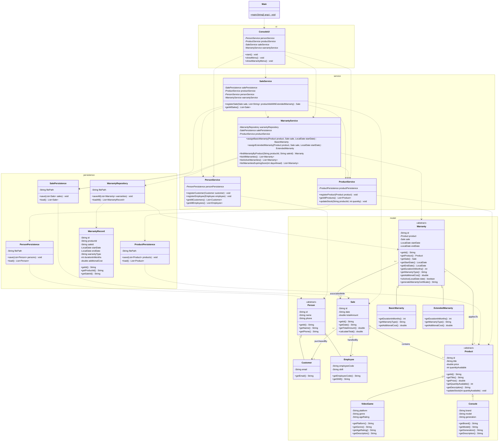

```mermaid
classDiagram
direction TB
	namespace model {
        class Person {
	        -String id
	        -String name
	        -String phone
	        +getId() String
	        +getName() String
	        +getPhone() String
        }

        class Customer {
	        -String email
	        +getEmail() String
        }

        class Employee {
	        -String employeeCode
	        -String shift
	        +getEmployeeCode() String
	        +getShift() String
        }

        class Product {
	        -String id
	        -String title
	        -double price
	        -int quantityAvailable
	        +getId() String
	        +getTitle() String
	        +getPrice() double
	        +getQuantityAvailable() int
	        +getDescription() String*
	        +updateStock(int quantityAvailable) void
        }

        class VideoGame {
	        -String platform
	        -String genre
	        -String ageRating
	        +getPlatform() String
	        +getGenre() String
	        +getAgeRating() String
	        +getDescription() String
        }

        class Console {
	        -String brand
	        -String model
	        -String generation
	        +getBrand() String
	        +getModel() String
	        +getGeneration() String
	        +getDescription() String
        }

        class Sale {
	        -String id
	        -String date
	        -double totalAmount
	        +getId() String
	        +getDate() String
	        +getTotalAmount() double
	        +calculateTotal() double
        }

        class Warranty {
	        -String id
	        -Product product
	        -Sale sale
	        -LocalDate startDate
	        -LocalDate endDate
	        +getId() String
	        +getProduct() Product
	        +getSale() Sale
	        +getStartDate() LocalDate
	        +getEndDate() LocalDate
	        +getDurationInMonths() int*
	        +getWarrantyType() String*
	        +getAdditionalCost() double*
	        +isActive(LocalDate date) boolean
	        +generateWarrantyCertificate() String
        }

        class BasicWarranty {
	        +getDurationInMonths() int
	        +getWarrantyType() String
	        +getAdditionalCost() double
        }

        class ExtendedWarranty {
	        +getDurationInMonths() int
	        +getWarrantyType() String
	        +getAdditionalCost() double
        }
	}

	namespace persistence {
        class ProductPersistence {
	        -String filePath
	        +save(List~Product~ products) void
	        +load() List~Product~
        }

        class PersonPersistence {
	        -String filePath
	        +save(List~Person~ persons) void
	        +load() List~Person~
        }

        class SalePersistence {
	        -String filePath
	        +save(List~Sale~ sales) void
	        +load() List~Sale~
        }

        class WarrantyRepository {
	        -String filePath
	        +saveAll(List~Warranty~ warranties) void
	        +loadAll() List~WarrantyRecord~
        }

        class WarrantyRecord {
	        -String id
	        -String productId
	        -String saleId
	        -LocalDate startDate
	        -LocalDate endDate
	        -String warrantyType
	        -int durationInMonths
	        -double additionalCost
	        +getId() String
	        +getProductId() String
	        +getSaleId() String
        }
	}

	namespace service {
        class ProductService {
	        -ProductPersistence productPersistence
	        +registerProduct(Product product) void
	        +getAllProducts() List~Product~
	        +updateStock(String productId, int quantity) void
        }

        class PersonService {
	        -PersonPersistence personPersistence
	        +registerCustomer(Customer customer) void
	        +registerEmployee(Employee employee) void
	        +getAllCustomers() List~Customer~
	        +getAllEmployees() List~Employee~
        }

        class WarrantyService {
	        -WarrantyRepository warrantyRepository
	        -SalePersistence salePersistence
	        -ProductService productService
	        +assignBasicWarranty(Product product, Sale sale, LocalDate startDate) BasicWarranty
	        +assignExtendedWarranty(Product product, Sale sale, LocalDate startDate) ExtendedWarranty
	        +findWarrantyByProduct(String productId, String saleId) Warranty
	        +listAllWarranties() List~Warranty~
	        +listActiveWarranties() List~Warranty~
	        +listWarrantiesExpiringSoon(int daysAhead) List~Warranty~
        }

        class SaleService {
	        -SalePersistence salePersistence
	        -ProductService productService
	        -PersonService personService
	        -WarrantyService warrantyService
	        +registerSale(Sale sale, List~String~ productIdsWithExtendedWarranty) Sale
	        +getAllSales() List~Sale~
        }
	}

	namespace ui {
        class ConsoleUI {
	        -PersonService personService
	        -ProductService productService
	        -SaleService saleService
	        -WarrantyService warrantyService
	        +start() void
	        +showMenu() void
	        +showWarrantyMenu() void
        }
	}

    class Main {
	    +main(String[] args) void$
    }

	<<abstract>> Person
	<<abstract>> Product
	<<abstract>> Warranty

    Person <|-- Customer
    Person <|-- Employee
    Product <|-- VideoGame
    Product <|-- Console

    Warranty <|-- BasicWarranty
    Warranty <|-- ExtendedWarranty

    Sale "0..*" --> "1" Customer : purchasedBy
    Sale "0..*" --> "1" Employee : handledBy
    Sale "1" o-- "1..*" Product : contains

    Warranty "0..*" --> "1" Product : appliesTo
    Warranty "0..*" --> "1" Sale : associatedWith

    ProductPersistence ..> Product
    PersonPersistence ..> Person
    SalePersistence ..> Sale
    WarrantyRepository ..> Warranty
    WarrantyRepository ..> WarrantyRecord

    PersonService ..> PersonPersistence
    ProductService ..> ProductPersistence

    SaleService ..> SalePersistence
    SaleService ..> ProductService
    SaleService ..> PersonService
    SaleService ..> WarrantyService

    WarrantyService ..> WarrantyRepository
    WarrantyService ..> SalePersistence
    WarrantyService ..> ProductService
    WarrantyService ..> Warranty

    ProductService ..> Product
    PersonService ..> Person
    SaleService ..> Sale

    ConsoleUI ..> PersonService
    ConsoleUI ..> ProductService
    ConsoleUI ..> SaleService
    ConsoleUI ..> WarrantyService
    Main ..> ConsoleUI
```
 